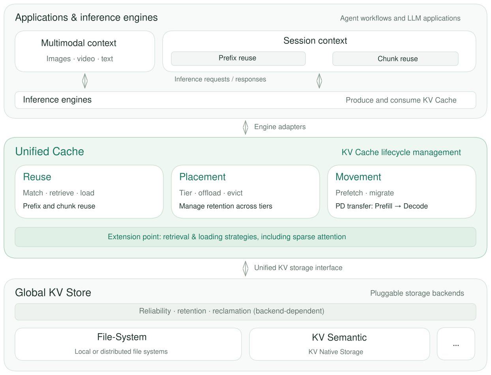

<!-- markdownlint-disable MD001 MD041 -->

  <picture>
    <source media="(prefers-color-scheme: dark)" srcset="https://raw.githubusercontent.com/ModelEngine-Group/unified-cache-management/main/docs/source/logos/UCM-dark.png">
    
  </picture>

<h3 align="center">Unified KV Cache management for LLM inference</h3>

  <a href="https://ucm.readthedocs.io/en/latest/">Documentation</a> ·
  <a href="https://ucm.readthedocs.io/en/latest/user-guide/quick_start/">Quickstart</a> ·
  <a href="https://modelengine-ai.net/#/ucm">Website</a> ·
  <a href="./README_zh.md">中文</a>

[![DeepWiki](https://img.shields.io/badge/DeepWiki-Ask_AI-_.svg?style=flat&color=0052D9&labelColor=000000&logo=data:image/png;base64,iVBORw0KGgoAAAANSUhEUgAAACwAAAAyCAYAAAAnWDnqAAAAAXNSR0IArs4c6QAAA05JREFUaEPtmUtyEzEQhtWTQyQLHNak2AB7ZnyXZMEjXMGeK/AIi+QuHrMnbChYY7MIh8g01fJoopFb0uhhEqqcbWTp06/uv1saEDv4O3n3dV60RfP947Mm9/SQc0ICFQgzfc4CYZoTPAswgSJCCUJUnAAoRHOAUOcATwbmVLWdGoH//PB8mnKqScAhsD0kYP3j/Yt5LPQe2KvcXmGvRHcDnpxfL2zOYJ1mFwrryWTz0advv1Ut4CJgf5uhDuDj5eUcAUoahrdY/56ebRWeraTjMt/00Sh3UDtjgHtQNHwcRGOC98BJEAEymycmYcWwOprTgcB6VZ5JK5TAJ+fXGLBm3FDAmn6oPPjR4rKCAoJCal2eAiQp2x0vxTPB3ALO2CRkwmDy5WohzBDwSEFKRwPbknEggCPB/imwrycgxX2NzoMCHhPkDwqYMr9tRcP5qNrMZHkVnOjRMWwLCcr8ohBVb1OMjxLwGCvjTikrsBOiA6fNyCrm8V1rP93iVPpwaE+gO0SsWmPiXB+jikdf6SizrT5qKasx5j8ABbHpFTx+vFXp9EnYQmLx02h1QTTrl6eDqxLnGjporxl3NL3agEvXdT0WmEost648sQOYAeJS9Q7bfUVoMGnjo4AZdUMQku50McDcMWcBPvr0SzbTAFDfvJqwLzgxwATnCgnp4wDl6Aa+Ax283gghmj+vj7feE2KBBRMW3FzOpLOADl0Isb5587h/U4gGvkt5v60Z1VLG8BhYjbzRwyQZemwAd6cCR5/XFWLYZRIMpX39AR0tjaGGiGzLVyhse5C9RKC6ai42ppWPKiBagOvaYk8lO7DajerabOZP46Lby5wKjw1HCRx7p9sVMOWGzb/vA1hwiWc6jm3MvQDTogQkiqIhJV0nBQBTU+3okKCFDy9WwferkHjtxib7t3xIUQtHxnIwtx4mpg26/HfwVNVDb4oI9RHmx5WGelRVlrtiw43zboCLaxv46AZeB3IlTkwouebTr1y2NjSpHz68WNFjHvupy3q8TFn3Hos2IAk4Ju5dCo8B3wP7VPr/FGaKiG+T+v+TQqIrOqMTL1VdWV1DdmcbO8KXBz6esmYWYKPwDL5b5FA1a0hwapHiom0r/cKaoqr+27/XcrS5UwSMbQAAAABJRU5ErkJggg==)](https://deepwiki.com/ModelEngine-Group/unified-cache-management)

## What is UCM?

**Unified Cache Manager (UCM) is a unified KV Cache layer between inference engines and storage.** It manages cache reuse, placement, and movement so that compatible requests and inference instances can reuse existing computation.

Agent workflows, multi-turn conversations, and multimodal applications often revisit the same context. UCM makes reusable KV Cache available beyond an individual inference process and extends cache capacity through external storage. This helps reduce repeated computation and the pressure on accelerator memory.

Engine adapters, cache mechanisms, and storage backends can evolve independently through pluggable interfaces.

## Architecture

- **Applications and inference engines** produce and consume KV Cache. Reuse patterns include multimodal context, shared prefixes, and cached chunks used by mechanisms such as KV Bridge.
- **Unified Cache** manages the cache's usage lifecycle: what to reuse, where to retain it, and when to move it. Prefill/decode (PD) transfer is one form of cache movement. Pluggable retrieval and loading strategies also support sparse attention.
- **Global KV Store** provides a common storage abstraction over file systems, memory pools, and other backends. Store implementations handle retention, reclamation, and reliability according to their capabilities.

Feature availability and storage guarantees depend on the selected engine, model, platform, and backend; see [supported configurations](https://ucm.readthedocs.io/en/latest/user-guide/support-matrix/).

## Getting Started

1. Check the [support matrix](https://ucm.readthedocs.io/en/latest/user-guide/support-matrix/) for a compatible configuration.
2. Follow the [Quickstart](https://ucm.readthedocs.io/en/latest/user-guide/quick_start/) to select installation artifacts, configure storage, and run an engine with UCM.
3. Use the [operations guide](https://ucm.readthedocs.io/en/latest/user-guide/observability/) to verify cache reuse and inspect runtime behavior.

Installation commands, image tags, engine versions, and configuration examples are maintained in the documentation. For deployment problems, see [troubleshooting](https://ucm.readthedocs.io/en/latest/reference/troubleshooting/).

## Contributing & Community

Contributions to engine adapters, storage backends, cache mechanisms, tests, and documentation are welcome.

- Start with the [Contributing Guide](https://ucm.readthedocs.io/en/latest/developer-guide/contribute/).
- Add a backend with [Extending Store](https://ucm.readthedocs.io/en/latest/developer-guide/extending-store/).
- Report bugs and propose features through [GitHub Issues](https://github.com/ModelEngine-Group/unified-cache-management/issues).

## License

UCM is licensed under the MIT license with additional conditions. Read [LICENSE](./LICENSE) for the full terms.
